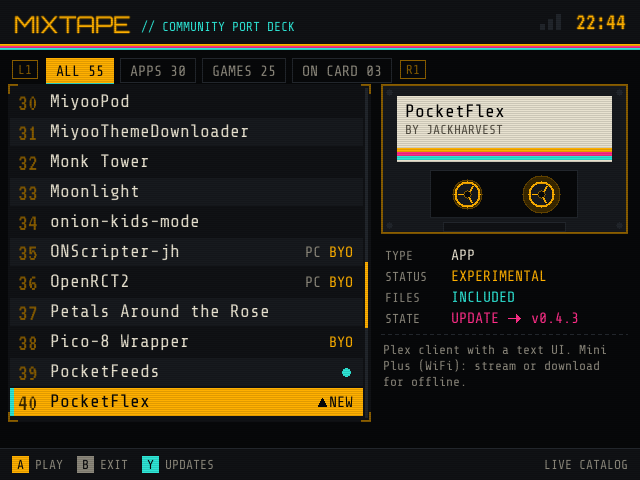
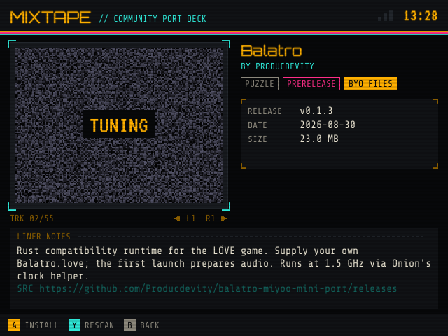
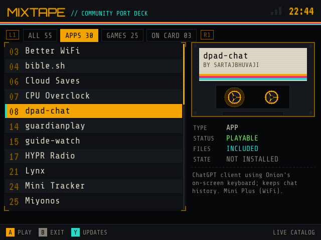
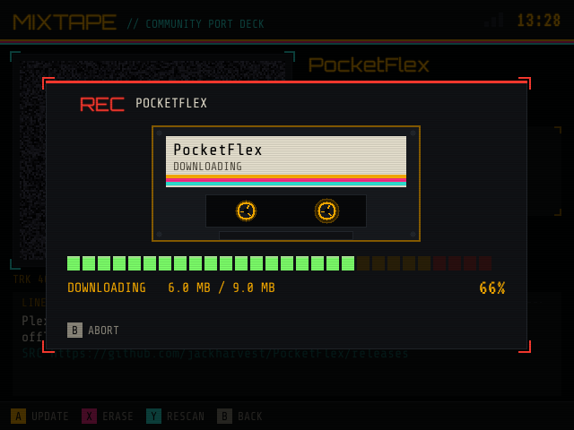
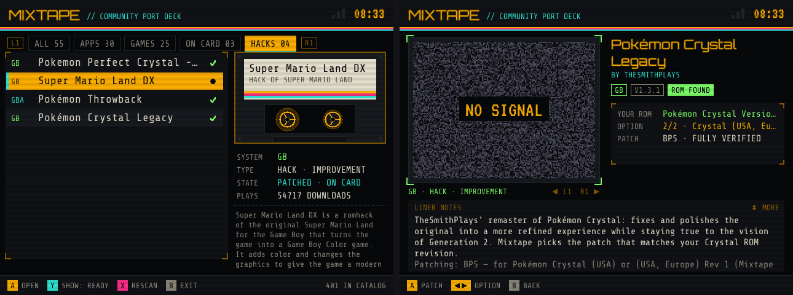

# MIXTAPE

**A community port deck for OnionOS on the Miyoo Mini Plus.** Browse the community-made apps and game ports for your handheld, then install, update and remove them over Wi-Fi without taking the SD card out.

> 🤖 **Built by Claude.** Mixtape was designed and written by [Claude](https://claude.ai), Anthropic's AI model, at the request of [@snyderman3000](https://github.com/snyderman3000). He came up with the idea, chose the direction and tested it on real hardware. Claude wrote the code, the documentation and the artwork. Please report bugs through [Issues](https://github.com/snyderman3000/mixtape/issues).

| | |
|---|---|
|  |  |
|  |  |

## Features

- **The whole community catalog.** Mixtape reads the live [MiyooMini-Ports](https://github.com/Producdevity/MiyooMini-Ports) catalog maintained by Producdevity, so new ports appear without a Mixtape update. If you're offline it uses the last catalog it downloaded, or a copy built into the app. A few projects not in that catalog yet (such as [Panel Attack](https://github.com/snyderman3000/panelattack-miyoo)) are listed from Mixtape's own [`catalog/extra.json`](catalog/extra.json).
- **One-button installs.** It downloads each project's newest GitHub release, detects where the files belong (`App/`, `Roms/PORTS`, and so on) and installs them. Projects without releases are installed from their repository.
- **Updates.** Press Y to check everything Mixtape installed. Updates keep settings files you've edited.
- **Romhacks in one press (HACKS tab).** Mixtape checks the ROMs already on your card and lists the hacks and fan translations you can make from them, including 38 Pokémon hacks and hundreds of NES, SNES, Game Boy and GBA classics. Press A and it downloads the patch, checks your ROM is the exact version the hack needs, patches it, and saves the result as a new game next to the original. It **never downloads games**; you supply your own ROMs.
- **Updates itself.** Mixtape checks its own GitHub releases at startup and shows **▲ READY · SELECT** in the header when there's a new version. Press SELECT to install it; your settings are kept and Mixtape restarts.
- **Clean removal.** Erase deletes only the files Mixtape recorded when installing, and refreshes the Ports list for you.
- **Safe by design.** Nothing is written outside the SD card, and Onion's own system files are never replaced.
- **Bring-your-own-files games are marked.** Ports like Balatro, Fallout and Half-Life need your own legally purchased game data. Mixtape tags them **BYO** and shows where the files go. It never downloads commercial game data.
- **Cassette-futurism UI.** Amber phosphor, scanlines, spinning tape reels and an LED VU meter for downloads.

## Install

1. Download `Mixtape-vX.Y.Z-OnionOS.zip` from [Releases](https://github.com/snyderman3000/mixtape/releases).
2. Extract it and copy the `App` folder to the root of your SD card, merging it with the `App` folder already there.
3. Open **Apps → Mixtape**. Wi-Fi must be on (Settings → Network).

Requires OnionOS 4.2 or newer. Wi-Fi features need a Miyoo Mini Plus or Mini Flip. On the original Mini, Mixtape shows the catalog but can't download anything.

## Controls

| Button | Action |
|---|---|
| D-pad ↑ ↓ | Move · ← → page up/down |
| L1 / R1 | Switch tab: All · Apps · Games · On card |
| A | Open / install / update |
| X | Erase (only things Mixtape installed) |
| Y | Check for updates (list) · re-check release (details) |
| SELECT | Update Mixtape itself |
| HACKS tab: Y / X | Filter (Ready, Pokémon, NES, SNES, GB, GBA, All) / rescan your ROMs |
| Hack details: ◀ ▶ | Choose between a hack's versions, when it has several |
| B | Back / exit · MENU exits anywhere |

List markers: **●** installed by Mixtape · **○** found on the card (installed by hand) · **▲NEW** update available · **BYO** bring your own game files · **PC** must be installed from a computer (for example, `.7z` releases).

## Romhacks



The HACKS tab lists about 400 popular hacks and English translations for NES, SNES, Game Boy/Color and GBA. They come from the [RomHacking.net archive](https://archive.org/details/rhdn-20210914) on the Internet Archive, plus a few newer Pokémon hacks released on GitHub ([`tools/hackdb/extras.json`](tools/hackdb/extras.json)).

- **Your ROMs, checked by checksum.** Mixtape reads ROMs in `Roms/FC`, `Roms/SFC`, `Roms/GB`, `Roms/GBC` and `Roms/GBA` (plain or zipped; 7z isn't supported) and compares their CRC32 with what each hack was made for. SNES copier headers and NES headers are handled automatically.
- **Patching on the device.** IPS, BPS and UPS patches are supported. BPS/UPS patches check the finished game too, so those show **FULLY VERIFIED**. The new game is saved beside the original (for example `Roms/GBA/Pokémon Throwback v210717.gba`), and your original is never changed. X erases a patched game you made.
- **The catalog is built and checked automatically.** A GitHub Actions job ([`tools/hackdb`](tools/hackdb)) reads the archive, picks popular entries, validates every patch, and downloads every entry the way the device will before publishing [`catalog/hacks.json`](catalog/hacks.json). See [`catalog/report.txt`](catalog/report.txt) and [`catalog/verify.txt`](catalog/verify.txt).
- **Want a hack added?** Hacks released on GitHub can be added to `extras.json` with a pull request.

## Settings

`App/Mixtape/data/config.json`:

- `github_token`: optional GitHub personal access token (no scopes needed). Without one, GitHub allows 60 release lookups per hour per network.
- `catalog_url`: point Mixtape at a different `ports.json`.
- `extra_url`: point Mixtape at a different extra-ports list (default: this repo's `catalog/extra.json`).

`App/Mixtape/data/recipes.json` (optional) overrides the built-in install hints in [`assets/recipes.json`](assets/recipes.json).

Logs are written to `App/Mixtape/data/mixtape.log`.

## How it works

| File | Purpose |
|---|---|
| `device.go` | Framebuffer output (rotated 180° for the Mini's panel) and button input from `/dev/input/event0` |
| `gfx.go` | Software renderer: fonts, cassette, VU meter and CRT effects |
| `ui.go` | Screens and navigation |
| `catalog.go` | Loads the MiyooMini-Ports catalog and the extra ports in `catalog/extra.json`, with cache and built-in fallback |
| `github.go` | Release lookup and choosing the right download (prefers OnionOS builds) |
| `install.go` | Download, archive layout detection, safe extraction, install records, erase |
| `hacks.go`, `ui_hacks.go` | Romhack catalog, ROM scanning and matching, patching, the HACKS tab |
| `patch/` | IPS, UPS and BPS patchers (tested against Flips) |
| `tools/hackdb` | Builds and verifies the romhack catalog |
| `assets/recipes.json` | Per-project hints for the few projects that need them |

It compiles to a single static ARMv7 binary written in Go, with no SDL or C toolchain involved.

## Building

Requires Go 1.24 or newer.

```sh
./build.sh            # runs the tests, then builds dist/Mixtape-vX.Y.Z-OnionOS.zip
go run . -shot list   # renders a screen to shot.png on your PC (boot|list|apps|detail|busy|done|error|confirm)
```

### Releasing

Bump `version` in `main.go`, add notes in `docs/releases/vX.Y.Z.md`, and push to `main`. GitHub Actions runs the tests, builds the zip, tags the version and publishes the release. Every push to `main` is also test-built by the CI workflow.

## Credits

- **Catalog:** [MiyooMini-Ports](https://github.com/Producdevity/MiyooMini-Ports) by Producdevity (MIT). Mixtape is only a front end for it. The ports belong to their authors.
- **Reference:** [PocketFeeds](https://github.com/IC-0n417/PocketFeeds) by IC-0n417 showed how to drive the Mini's framebuffer from Go.
- **Fonts:** Share Tech Mono, VT323 and Orbitron (SIL Open Font License).
- **CA certificates:** Mozilla bundle via curl (MPL 2.0).
- **OS:** [OnionOS](https://github.com/OnionUI/Onion).
- **Code, docs and art:** written by Claude (Anthropic).

## License

MIT. See [LICENSE](LICENSE). Bundled fonts and certificates keep their own licenses. See [THIRD_PARTY_NOTICES.md](THIRD_PARTY_NOTICES.md).
